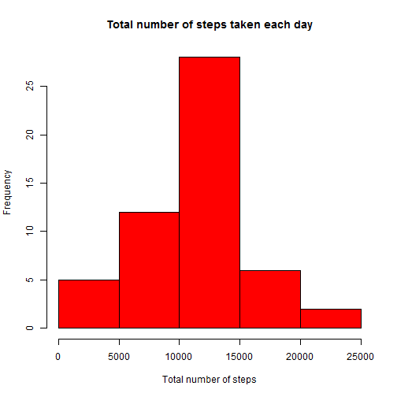
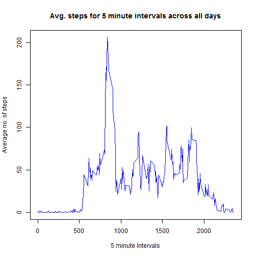
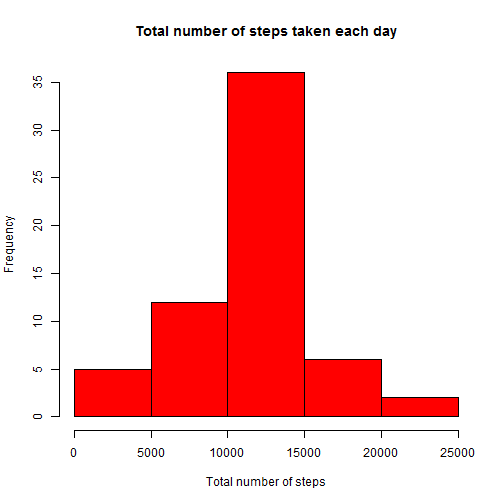
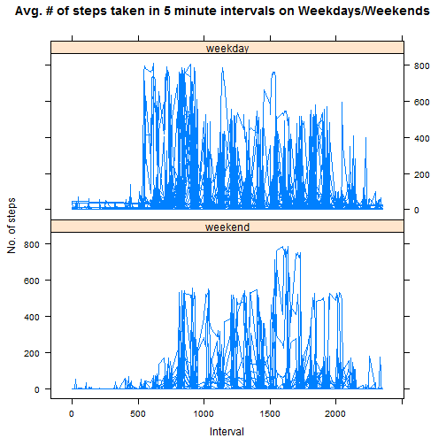

**Assignment: Course Project 1**
================================

---
title: "PA1_template"
author: "Shubhadeep Roy"
date: "Friday, February 05, 2016"
output: html_document
---


## **Introduction to the problem**
This assignment makes use of data from a personal activity monitoring device. 
This device collects data at 5 minute intervals through out the day. The data consists of two months of data from an anonymous individual collected during the months of October and November, 2012 and include the number of steps taken in 5 minute intervals each day.

The data for this assignment is contained in a zip file **Activity monitoring 
data.zip** and the variables included in this dataset are:

* steps: Number of steps taken in a 5-minute interval (missing values are coded 
as NA)

* date: The date on which the measurement was taken in YYYY-MM-DD format

* interval: Identifier for the 5-minute interval in which measurement was taken

The dataset is stored in a comma-separated-value (CSV) file and there are a 
total of 17,568 observations in this dataset.


## **Start of Assignment**
  
#### **Loading and preprocessing the data**

##### 1. Load the data (i.e. read.csv())

```r
if (!file.exists("activity.csv")) {
    unzip("activity.zip")
}

activity1 <- read.csv("activity.csv", header=TRUE, sep=",", na.strings="NA")
```

##### 2. Process/transform the data

```r
activity1$date <- as.Date(as.character(activity1$date), "%Y-%m-%d")
```


#### **What is the mean total number of steps taken per day?**

##### 1. Calculate the total number of steps taken per day

```r
totByDay1 <- aggregate(steps~date, data=activity1, FUN=sum)
```

#### 2. Make a histogram of the total number of steps taken each day

```r
hist(totByDay1$steps, xlab="Total number of steps", 
     main="Total number of steps taken each day", col="red"
     )
```



#### 3. Calculate and report the mean and median of the total number of steps taken per day

```r
activity1.mean = mean(totByDay1$steps)
activity1.median = median(totByDay1$steps)
```

**Mean of total number of steps taken per day = 1.0766189 &times; 10<sup>4</sup>**  
**Median of total number of steps taken per day = 10765**

So, we see here that there is a slight difference between the Mean and the 
Median of total number of steps taken per day.


#### **What is the average daily activity pattern?**

##### 1. Make a time series plot (i.e. type = "l") of the 5-minute interval (x-axis) and the average number of steps taken, averaged across all days (y-axis)

```r
avgByInterval1 <- aggregate(steps~interval, data=activity1, FUN=mean)

with(avgByInterval1, 
     plot(x=interval, y=steps, xlab="5 minute Intervals", 
          ylab="Average no. of steps", col="blue", 
          main="Avg. steps for 5 minute intervals across all days", type="l", 
          )
     )
```



##### 2. Which 5-minute interval, on average across all the days in the dataset, contains the maximum number of steps?

```r
maxInterval <- avgByInterval1[which.max(avgByInterval1$steps), 1]
maxSteps <- avgByInterval1[which.max(avgByInterval1$steps), 2]
```

**Interval with maximum no. of steps = 835**  
**No. of Steps = 206.1698113**  

#### **Imputing missing values**

##### 1. Calculate and report the total number of missing values in the dataset (i.e. the total number of rows with NAs)

```r
missingVal <- sum(is.na(activity1$steps))
```

**Total Missing Values = 2304**  

##### 2. Fill the missing values (NA) with the mean of that 5 minute interval

```r
library(plyr)
impute.mean <- function(x) replace(x, is.na(x), mean(x, na.rm = TRUE))
```

##### 3. Create a new dataset that is equal to the original dataset but with the missing data filled in

```r
activity2 <- ddply(activity1, ~ interval, transform, steps = impute.mean(steps))

# Format the date field
activity2$date <- as.Date(as.character(activity2$date), "%Y-%m-%d")

# Order the new dataset according to "date"
activity2  <- arrange(activity2, date)
```

##### 4. Make a histogram of the total number of steps taken each day and calculate and report the mean and median of the total number of steps taken per day

```r
# Calculate the total number of steps taken per day
totByDay2 <- aggregate(steps~date, data=activity2, FUN=sum)

hist(totByDay2$steps, xlab="Total number of steps", 
     main="Total number of steps taken each day", col="red"
     )
```



```r
activity2.mean <- mean(totByDay2$steps)
activity2.median <- median(totByDay2$steps)
```

**Mean of new dataset = 1.0766189 &times; 10<sup>4</sup>**  
**Median of new dataset = 1.0766189 &times; 10<sup>4</sup>**  

So we see here that by imputing the missing values, the Mean and median of the 
total number of steps taken are same.


#### **Are there differences in activity patterns between weekdays and weekends?**
##### 1. Create a new factor variable in the dataset with two levels: 'weekday' and 'weekend' indicating whether a given date is a weekday or weekend day

```r
weekday = c("Monday", "Tuesday", "Wednesday", "Thursday", "Friday")

activity2$day <- factor((weekdays(activity2$date) %in% weekday), 
                         levels=c(FALSE, TRUE), labels=c("weekend", "weekday"
                         )
                        )
```

##### 2. Make a panel plot containing a time series plot (i.e. type = "l") of the 5-minute interval (x-axis) and the average number of steps taken, averaged across all weekday days or weekend days (y-axis).

```r
library(lattice)

xyplot(steps~interval | as.factor(day), data=activity2, layout=c(1,2), 
       type="l", xlab="Interval", ylab="No. of steps", 
       main="Avg. # of steps taken in 5 minute intervals on Weekdays/Weekends",
       )
```



From this plot, it is clearly visible that the daily activity on weekdays is 
higher than the daily activity on weekends.

## **End of Assignment**
